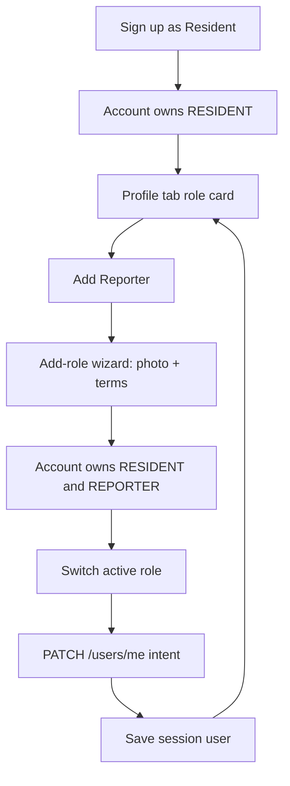

# Resident + Reporter on one account (multi-role) — plan

## Goal

Let one Taka account hold **both** a Resident profile and a Reporter profile on the
same phone number, signed in once, and switch the **active role** from the Profile
tab (Resident <-> Reporter). Preferences (language, appearance), phone number and
personal name are shared; the intent-specific profiles stay distinct. The model
must generalise so Commercial can be added later without rework.

## Chosen model: one account, many roles

`User.phone` stays unique (one account per number). `User.intent` is repurposed as
the **active role**, and the set of **owned roles** is derived from which profile
rows exist. Because [`ResidentProfile`](../taka-server-resident/prisma/schema.prisma:46),
[`ReporterProfile`](../taka-server-resident/prisma/schema.prisma:60) and
[`CommercialProfile`](../taka-server-resident/prisma/schema.prisma:68) are each
`userId @unique`, one `User` can already hold one of each — so **no Prisma migration
is required**. Two roles share the `User` row (phone, name, language, theme) and
differ by profile row.

Path:

1. An account registers as today (one role).
2. From Profile, `Add <role>` runs the authenticated part of the sign-up wizard and
   attaches the missing profile row.
3. From Profile, `Switch` changes the active role and returns the account shaped for
   that role.

## Backend changes — taka-server-resident

### Response shape
- `PublicUser` ([`registration.ts`](../taka-server-resident/src/services/registration.ts:22)) gains
  `roles: UserIntent[]`.
- `toPublicUserFromProfile` ([`registration.ts`](../taka-server-resident/src/services/registration.ts:193))
  derives `roles` from the loaded `resident` / `reporter` / `commercial` relations;
  `intent` stays the active role.
- `toPublicUser` ([`registration.ts`](../taka-server-resident/src/services/registration.ts:123))
  sets `roles: [payload.intent]` for a fresh registration.
- Login ([`auth.ts`](../taka-server-resident/src/routes/auth.ts:184)) and
  `GET /users/me` ([`users.ts`](../taka-server-resident/src/routes/users.ts:31)) then
  return `roles` for free.

### Add a role
- New authenticated route `POST /users/me/intents`
  ([`users.ts`](../taka-server-resident/src/routes/users.ts:40) area), guarded by
  `requireAccessToken` ([`middleware/auth.ts`](../taka-server-resident/src/middleware/auth.ts:118)).
- Payload: reuse the register schemas minus `phone` — add
  `residentProfileSchema = residentPayloadSchema.omit({ phone: true })` and the
  reporter equivalent, unioned by `intent`, in
  [`schemas/auth.ts`](../taka-server-resident/src/schemas/auth.ts:42). Phone comes
  from the token, never the body.
- New service `addIntentToUser(userId, payload)` in
  [`registration.ts`](../taka-server-resident/src/services/registration.ts:324):
  load the account, refuse if the role is already held (409), run the existing
  cross-table meter-claim guard for a resident, create the profile row only, set
  `User.intent` to the new role (so the client lands in it), return the updated
  `PublicUser`.
- Extract profile-only create helpers from
  [`createResident`](../taka-server-resident/src/services/registration.ts:58) /
  [`createReporter`](../taka-server-resident/src/services/registration.ts:81) so both
  registration and add-role share the column mapping.

### Switch active role
- Add `intent` to `updateUserSchema`
  ([`schemas/users.ts`](../taka-server-resident/src/schemas/users.ts:46)) as an
  optional `z.enum`.
- In [`updateUser`](../taka-server-resident/src/services/users.ts:25): when `intent`
  is present, verify the account owns that role (profile row exists) and write
  `User.intent` **first**, then resolve name/picture/tax against the **new** active
  role. The route
  [`PATCH /users/me`](../taka-server-resident/src/routes/users.ts:40) already exists,
  so the client needs no new call shape.

### Knock-on guards
- [`updateSite`](../taka-server-resident/src/services/users.ts:156) already refuses a
  REPORTER — correct once active role can flip.
- [`deleteAccount`](../taka-server-resident/src/services/users.ts:264) deletes the
  whole `User` (cascades both profiles): behaviour stays, copy needs updating.
- Tests: extend [`tests/schemas.test.ts`](../taka-server-resident/tests/schemas.test.ts)
  and [`tests/api.test.ts`](../taka-server-resident/tests/api.test.ts) for the new
  schema, `roles` in responses, add-role and switch.

## Client changes — taka-app-resident

### Types, API, helpers
- [`SessionUser`](src/api/auth.ts:71) gains `roles?: UserIntent[]`
  (absent in older cached sessions -> treat as `[intent]`).
- New [`src/features/auth/roles.ts`](src/features/auth/roles.ts): `rolesOf(user)`,
  `hasRole(user, intent)`, `addableRoles(user)` (Resident + Reporter for now, the
  list is the only place Commercial is withheld).
- [`src/api/profile.ts`](src/api/profile.ts:15): add `intent?: UserIntent` to
  `AccountPatch` and an `addIntent(payload, token)` call to
  `/api/v1/users/me/intents`.
- [`src/api/schemas.ts`](src/api/schemas.ts:27): mirror the phone-less profile
  schemas for payload validation before the call.

### Profile screen — the requested entry point
In [`profile.tsx`](src/app/(tabs)/profile.tsx:246), above the settings card:
- A **role card** listing the roles the account holds, the active one marked.
  When more than one exists, a row per other role switches to it; a
  [`SegmentedControl`](src/components/segmented-control.tsx:1) matches the
  appearance/language rows already there.
- An **Add** row for each role not yet held, pushing the add-role flow.
- Switch handler: `updateAccount({ intent }, token)` ->
  [`saveSessionUser`](src/features/auth/session.ts:37) with the returned account ->
  local `setSession`, so the picture label
  ([`INTENT_COPY`](src/constants/registration.ts:45)) and the address row
  ([`needsLocation`](src/constants/registration.ts:42)) re-render for the new role.
  Failures reuse the existing inline [`saveError`](src/app/(tabs)/profile.tsx:81).
- New styles for the card; no change to the delete/settings rows beyond the copy.

### Add-role flow
Reuse the wizard rather than duplicate the resident path (luku + location + details
+ photo + review):
- [`SignUpContext`](src/features/signup/context.tsx:6) gains `mode: 'signup' |
  'addRole'`; in `addRole` the `intent` is preset, `phone`/`phoneVerified` come from
  the session, `verificationToken` stays null.
- [`signUpProgress`](src/features/signup/steps.ts:37) offsets past the
  intent/phone/verify steps when the mode is `addRole`.
- New route `src/app/add-role.tsx` (outside the tabs group) enters at
  [`postVerifyRouteFor`](src/features/signup/steps.ts:67) for the chosen role and
  hosts the same screens.
- [`review.tsx`](src/app/(auth)/sign-up/review.tsx:144) branches: `signup` calls
  `register*`; `addRole` calls `addIntent` with the access token, then
  `saveSessionUser` and `router.replace('/profile')`.
- Resident -> Reporter is light (name is shared, so photo + terms); Reporter ->
  Resident walks the full meter/location path.

### Copy
New keys in [`translations.ts`](src/features/i18n/translations.ts:22) for both `en`
and `sw` (`profile.rolesLabel`, `profile.currentMode`, `profile.switchTo*`,
`profile.add*`, `profile.roleSwitchFailed`, `addRole.*`). `TranslationKey` derives
from `en`, so both files must be updated together. Update
[`profile.deleteConfirmMessage`](src/features/i18n/translations.ts:265) to name both
roles.

## Edge cases to honour
- Reporter has no address/meter; switching to Reporter hides the address row and
  makes `edit-location` / `edit-tax-id` redirect (they already key off `intent`).
- `first_name` / `last_name` live on the `User` row, so both roles share one name —
  intended, and noted in the UI.
- Pictures are per-profile, so each role keeps its own image; the header shows the
  active role's.
- `registered: true` on OTP request is unchanged — the add-role path, not a second
  sign-up, is how a number gains a role.
- Cached sessions without `roles` fall back to `[intent]`.

## Verification
- Server: `pnpm test` and `pnpm typecheck` in
  [taka-server-resident](../taka-server-resident/package.json:11).
- Client: `pnpm typecheck` and `pnpm lint`
  ([package.json](package.json:44)).
- Manual: register Resident -> add Reporter -> switch both ways -> confirm
  `GET /users/me` reflects `intent` + `roles`, the address row hides for Reporter,
  language/theme survive a switch, and deleting removes both profiles.

## Flow

