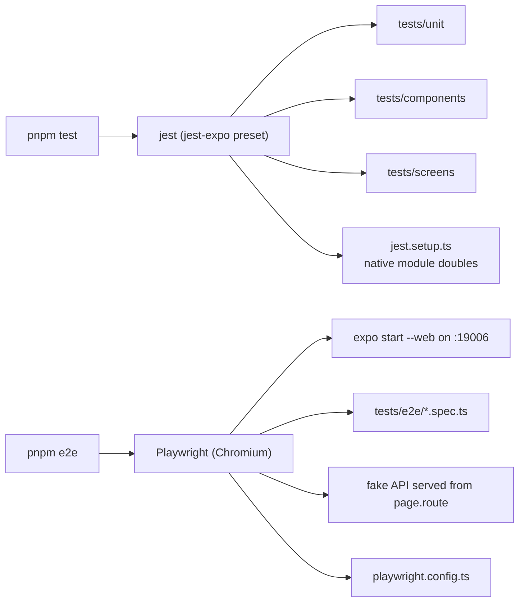

# How to run the tests

Two runners, both wired into [`package.json`](package.json): jest for the unit/component/screen suites, and Playwright for the end-to-end suite.



## Unit, component and screen tests (jest)

```bash
pnpm test              # all three jest suites
pnpm test:watch        # re-runs on change
pnpm test:coverage     # with a coverage report
```

Narrow it down by passing a path or a name — anything after the script name goes to jest:

```bash
pnpm test tests/unit/phone.test.ts     # one file
pnpm test tests/screens                # one directory
pnpm test -t "adds a Reporter role"    # tests whose title matches
```

Jest only looks at `tests/**/*.test.ts(x)` (see the `testMatch` in [`package.json`](package.json)), so the Playwright specs in `tests/e2e` are never picked up by it. The doubles that let screens render — SecureStore, safe-area insets, the map and image views — live in [`jest.setup.ts`](jest.setup.ts:1).

Type checking is separate and worth running alongside:

```bash
pnpm typecheck
```

## End-to-end tests (Playwright)

```bash
pnpm e2e               # playwright test
pnpm e2e:report        # open the HTML report from the last run
```

You do not start anything first. [`playwright.config.ts`](playwright.config.ts:1) declares a `webServer`, so Playwright launches `npx expo start --web --port 19006`, waits for that URL, runs the specs in Chromium at a Pixel 7 viewport, then shuts the server down. Port 19006 is deliberate — 8081 is often occupied, and Expo answers a busy port with a prompt a test run cannot answer. If you already have a dev server on 19006 it is reused rather than restarted.

It is also hermetic: [`fake-api.ts`](tests/e2e/fake-api.ts:1) intercepts every `/api/v1/**` request, so no server, database or OTP is involved, and `EXPO_PUBLIC_API_URL` in [`.env`](.env:10) is irrelevant to the run.

Useful variations:

```bash
pnpm e2e tests/e2e/switch-role.spec.ts   # one spec
pnpm e2e --ui                            # the interactive watch UI
pnpm e2e --headed                        # see the browser
pnpm e2e --debug                         # step through with the inspector
```

One-time setup, only if the browser is missing (it is already installed here):

```bash
npx playwright install chromium
```

## The caveat on `pnpm e2e`

`pnpm e2e` will not pass on this machine yet, and it is the web build's fault rather than the suite's. Metro cannot resolve any file under `src/app` and reports a doubled drive letter:

```
Unable to resolve module c:\C:\Users\...\src\app\(auth)\_layout.tsx
```

Both `npx expo start --web` and `npx expo export --platform web` fail the same way, and a raw request to the dev server returns HTTP 500. So the `webServer` step times out before a single test runs. Until that Metro path issue is fixed — running from a path without the OneDrive folder and the space in `Web Projects`, or bumping `@expo/cli` / `expo-router` — expect Playwright to report `Timed out waiting 300000ms from config.webServer`. The tests themselves are complete and will run unchanged once the build bundles.

[`tests/README.md`](tests/README.md:1) records this, along with what each suite covers.
